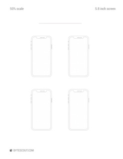

# Printable Wireframes Templates for iPhone Apps and Apple Watch Apps

Are you working on a new mobile or watch app idea? It is always good to draw sketches on paper first to discuss and to iterate. Here are a few templates that will help you in wireframing your app and app workflow.

Print on *US Letter Size* paper and draw your prototypes on these templates.

## How to use:

- download PDF file with the template (see below)
- print template on US Letter Size paper
- use pencil and pen to draw wireframes of your app on the template</li>
- show, iterate, discuss wireframes with potential users, friends, clients

## License: Common Creative License

##  Mobile Apps - Single Screen

| Screen Size | Screenshot | Download Template |
| -- | -- | -- |
| **6.1 Inches   (iPhone Xr)**  |    |  [**phone-6.1inch-wireframe.pdf**](phone-6.1inch-wireframe.pdf) |
| **5.8 Inches   (iPhone Xs)**  |  | [**phone-5.8inch-wireframe.pdf**](phone-5.8inch-wireframe.pdf) |
| **6.5 Inches   (iPhone Xs Max)** |  | [**phone-6.5inch-wireframe.pdf**](phone-6.5inch-wireframe.pdf) |

##  Mobile Apps - 4 Screens (2x2)

| Screen Size | Screenshot | Download Template |
| -- | -- | -- |
| **6.1 Inches   (iPhone Xr)**  |    |  [**phone-6.1inch-wireframe-2x2.pdf**](phone-6.1inch-wireframe-2x2.pdf) |
| **5.8 Inches   (iPhone Xs)**  |  | [**phone-5.8inch-wireframe-2x2.pdf**](phone-5.8inch-wireframe-2x2.pdf) |
| **6.5 Inches   (iPhone Xs Max)** |  | [**phone-6.5inch-wireframe-2x2.pdf**](phone-6.5inch-wireframe-2x2.pdf) |

##  Mobile Apps - 9 Screens (3x3)

| Screen Size | Screenshot | Download Template |
| -- | -- | -- |
| **6.1 Inches   (iPhone Xr)**  |    |  [**phone-6.1inch-wireframe-3x3.pdf**](phone-6.1inch-wireframe-3x3.pdf) |
| **5.8 Inches   (iPhone Xs)**  |  | [**phone-5.8inch-wireframe-3x3.pdf**](phone-5.8inch-wireframe-3x3.pdf) |
| **6.5 Inches   (iPhone Xs Max)** |  | [**phone-6.5inch-wireframe-3x3.pdf**](phone-6.5inch-wireframe-3x3.pdf) |

##  Apple Watch Apps - Single Screen

| Screen Size | Screenshot | Download Template |
| -- | -- | -- |
| **40 mm   (Apple Watch 4 40mm)**  |    |  [**watch-40mm-wireframe.pdf**](watch-40mm-wireframe.pdf) |
| **44 mm   (Apple Watch 4 44mm)**  |  | [**watch-44mm-wireframe.pdf**](watch-44mm-wireframe.pdf) |

##  Apple Watch Apps - 4 Screens (2x2)

| Screen Size | Screenshot | Download Template |
| -- | -- | -- |
| **40 mm   (Apple Watch 4 40mm)**  |    |  [**watch-40mm-wireframe-2x2.pdf**](watch-40mm-wireframe-2x2.pdf) |
| **44 mm   (Apple Watch 4 44mm)**  |  | [**watch-44mm-wireframe-2x2.pdf**](watch-44mm-wireframe-2x2.pdf) |

##  Apple Watch Apps - 9 Screens (3x3)

| Screen Size | Screenshot | Download Template |
| -- | -- | -- |
| **40 mm   (Apple Watch 4 40mm)**  |    |  [**watch-40mm-wireframe-3x3.pdf**](watch-40mm-wireframe-3x3.pdf) |
| **44 mm   (Apple Watch 4 44mm)**  |  |[**watch-44mm-wireframe-3x3.pdf**](watch-44mm-wireframe-3x3.pdf) |

